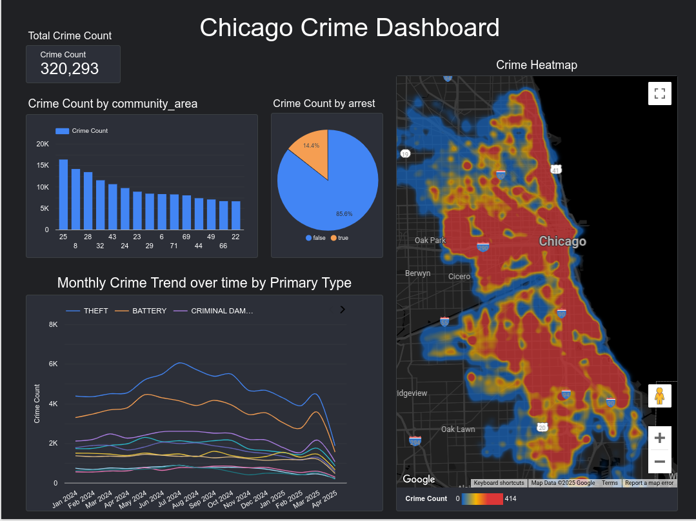
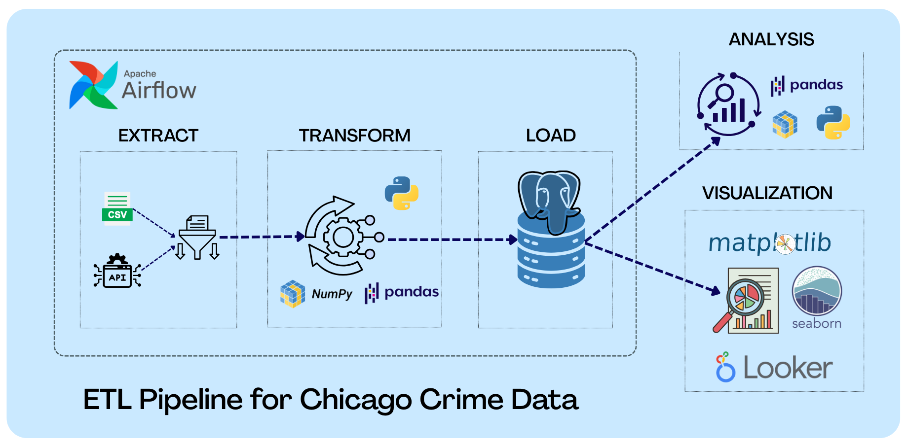
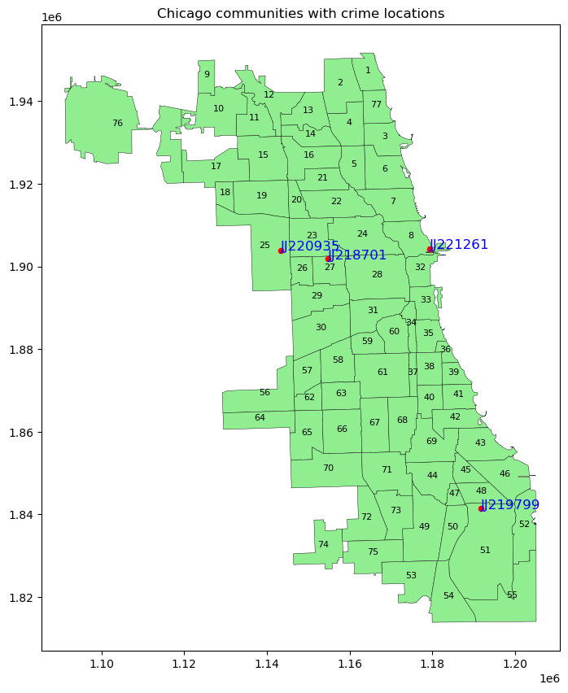

# Chicago Crime Data ETL Pipeline

This project implements a fully automated, cloud-native ETL pipeline for processing and visualizing the Chicago Crime dataset. The pipeline is orchestrated using Apache Airflow and deployed on a Google Cloud VM, with data hosted on an Aiven PostgreSQL database.

---



*Looker Studio Dashboard Preview*

## 🚀 Project Overview

- **Extract** crime data incrementally from Chicago's Socrata Open Data API
- **Transform** data: cleaning, type casting, spatial enrichment (GeoSpatial joins)
- **Load** into a cloud-hosted PostgreSQL database (Aiven on DigitalOcean)
- **Visualize** insights with Google Looker Studio
- **Automate** scheduling and monitoring with Airflow and systemd



*ETL Workflow Overview*

---

## 🛠 Technology Stack

- **Languages & Frameworks**: Python 3.10, Pandas, GeoPandas, sodapy, psycopg2
- **Orchestration**: Apache Airflow 2.7.2
- **Infrastructure**: 
  - Google Cloud e2-micro VM (Ubuntu)
  - Aiven PostgreSQL (managed by DigitalOcean)
- **Visualization**: Google Looker Studio
- **Deployment**: Systemd services + SSH port forwarding
- **Version Control**: [GitHub Repository](https://github.com/nishanKhanal/e2e-data-pipeline-for-chicago-crime)

---

## 📚 Project Motivation

Initially, the database was tunneled locally via Ngrok, but this was unsuitable for production due to reliability and security concerns. To make the pipeline production-ready:
- Moved to a **persistent VM** on Google Cloud.
- Hosted the database on **Aiven's free tier** PostgreSQL for cloud availability.
- Automated the full pipeline with **Airflow + systemd** for background operation.

---

## 🛡 Security and Secrets Management

- Used `.env` files to store database credentials and API tokens.
- Loaded secrets securely using `python-dotenv`.
- Never committed secrets to GitHub (added to `.gitignore`).

---

## ⚙️ How the Pipeline Works

### 1. Historical Data Load
- Direct download of full dataset via CSV.
- Chunked loading into PostgreSQL using `transform()` and `load()`.

### 2. Incremental Extraction
- Query Socrata API using `extract()` based on latest `updated_on` timestamp.

### 3. Transformation
- Standardize types (Int64, Float64, String, Boolean, Datetime)
- Spatial enrichment of missing community areas via GeoPandas
- Audit logs generated for dropped or duplicate rows.



*Community Area Imputation Example*

### 4. Loading
- Batched insertion (up to 50,000 records per batch) using psycopg2
- UPSERT logic for conflict handling (idempotent updates)

### 5. Visualization
- Connected Aiven PostgreSQL to Looker Studio.
- Created Geo Maps, Yearly Trends, Crime Type Distributions.


---

## 🔍 Monitoring and Logging

- **Systemd service** for auto-starting Airflow on VM reboot.
- **SSH port forwarding** for secure access to Airflow UI:

```bash
ssh -L 8080:localhost:8080 khanalni@my-vm-ip